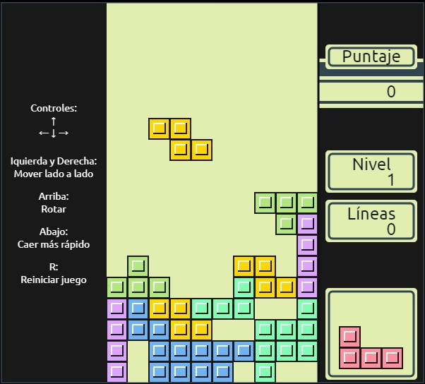

### Tetris
🎮 Proyecto: Tetris para Navegador
💻 Desarrollado utilizando HTML, CSS y JavaScript, este proyecto recrea el clásico juego de Tetris en un entorno web.
🎯 El juego incluye la lógica de rotación de piezas, caída progresiva, detección de líneas completas, y puntaje dinámico.
🚀 ¡Desafía a los usuarios a alcanzar la mayor puntuación y disfrutar de un clásico atemporal desde cualquier navegador!

# Screenshot
Aquí tenemos la captura de pantalla del proyecto:

